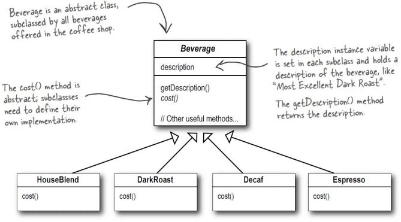
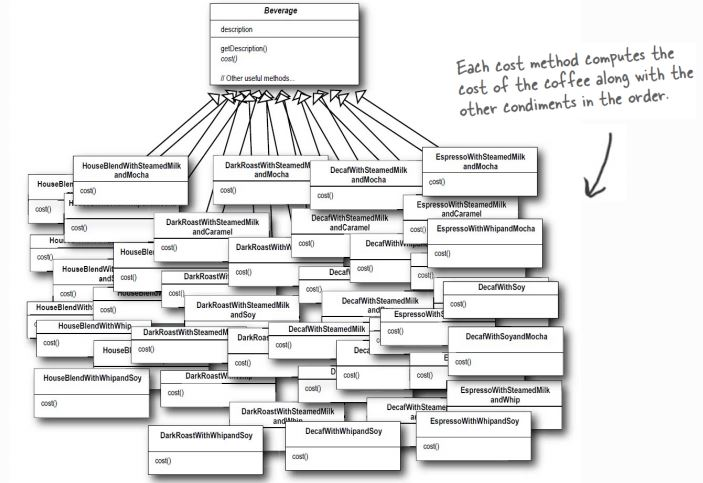
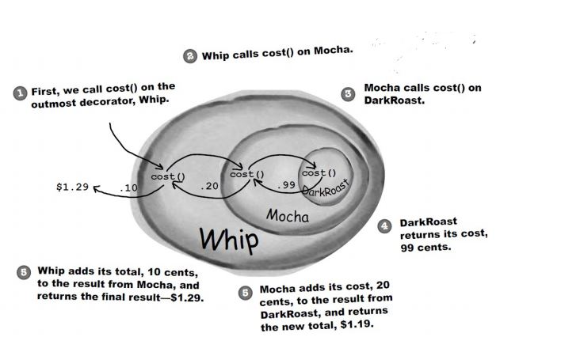
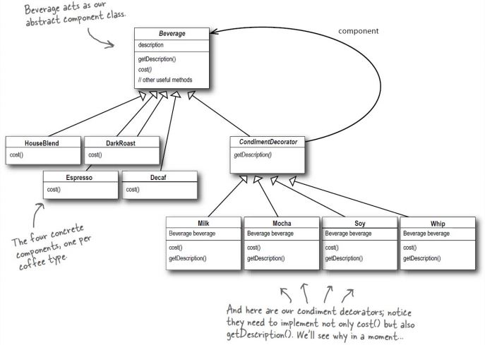
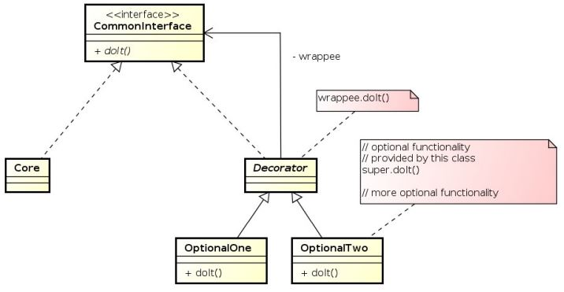
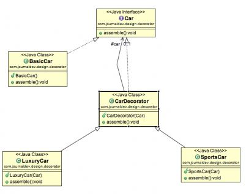

# Decorator Pattern
* __structural__ pattern
* Erlaubt neue Funktionalitäten hinzuzufügen ohne existierende Objekte zu verändern
* funktioniert wie eine Hülle
* __Code muss für Veränderungen geschlossen sein__
* Decorator-Klassen werden verwendet um konkrete Komponenten einzupacken
* Decorator-Klassen spiegeln den Typ der Komponnte wieder, die sie dekorieren
* Dekorierer ändern das Verhalten der Komponenten, indem sie
vor und/oder nach Methodenaufrufen auf der Komponente neue
Funktionalitäten hinzufügen
* Man kann eine Komponente mit einer beliebigen Anzahl von
Dekorieren einpacken
* Dekorierer sind für die Clients der Komponente üblicherweise
transparent

## Nachteile
* Das Offen/Geschlossen Prinzop überall zu verwenden ist
  * Verschwendung
  * unnötig
  * kann zu komplexen, schwer verständlichem Code führen
* Dekorierer können zu vielen kleinen Objekten führen
  * übermaßige Verwendung
  * unübersichtlicher Code

## Problem
* Wartungsalbtraum ohne Decorator
* Bestehenden Code zu ändern birgt Gefahr Fehler einzufügen bzw. unerwünschte Nebeneffekte zu verursachen

## Kontext
### Sternback-Kaffee
* Kaffeehauskette expandiert enorm
* Bestellsystem muss aktualisiert werden, um dem Getränkeangebot zu entsprechen
  * Zum Kaffee kann man natürlich zusätzliche Zutaten bestellen
  * Heiße Milch, Soja, Schokolade, Milchschaum … und monatlich werden es mehr!
* Bestehendes System wurde ursprünglich folgendermaßen designt ...

Jedoch wenn man dieses Bestellsystem erweitern möchte kommt das raus...

Man sieht es viel zu __unübersichtlich__ und __nicht veränderbar__ falls etwas geändert werden sollte.

#### Erklärung
1. Wir nehmen ein DunkleRöstung-Objekt,
2. dekorieren es mit einem Schoko-Objekt,
3. dekorieren es mit einem Milchschaum-Objekt,
4. rufen die Methode preis() auf und stützen uns auf Delegierung, um den Preis für die Zutaten hinzuzufügen.

Wie man sieht "dekoriert" man quasi. Man legt immer ein weiteres Objekt darüber und am Ende bekommt man richtigen Preis.

* Es können leicht und ohne Code zu ändern neue Zulagen kreiert werden. (__ohne__ Code Änderung)

#### Neues Design

## Lösung

### Design

#### CommonInterface
Abstrakte Komponenten Klasse

#### Core
sind die konkreten Komponenten Klassen wie: Espresso,...

#### Decorator
Das Objekt dient dazu das man immer mehr Optionen erstellen kann

#### OptionalOne
Erste Option die z.B.: auf/in einen Espresso kann

#### OptionalTwo
Zweite Option die z.B.: auf/in einen Espresso kann

#### OptionalThree
Es können beliebig viele Optionen erstellt werden

### Code-Beispiel

#### Diagramm

[Hier](https://github.com/TGM-HIT/sew4-design-patterns-amessner-tgm/tree/master/Decorator/Beispiel) sieht man ein Beispiel zum Decorator Pattern

Das Beispiel ist so aufgebaut:
* Man kann Sport-Elemente auf sein BasicCar hinzufügen
* Man kann Luxus-Elemente auf sein BasicCar hinzufügen

# Quellen
* https://elearning.tgm.ac.at/pluginfile.php/45189/mod_resource/content/0/DesignPatterns_Decorator.pdf
* https://www.tutorialspoint.com/design_pattern/decorator_pattern.htm
* https://www.journaldev.com/1540/decorator-design-pattern-in-java-example
