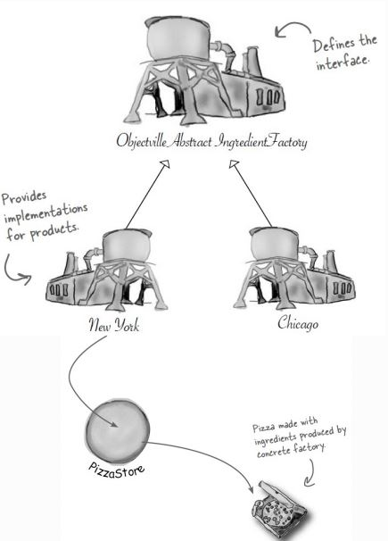
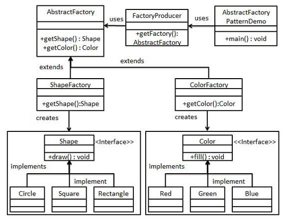

# Abstract Factory Pattern
* __creational__ Pattern
* Super Factory die Factories erschafft
* Bietet eine Schnittstelle zum Erstellen von Familien verwandter oder zusammenhängender Objekte an, ohne konkrete Klassen anzugeben.
* Kapselung
  * Änderungen müssen nur an einer Stelle durchgeführt werden
  * Konkrete Instantierung aus Client-Code entfernt

## Problem
* Code, der viele konkrete Klassen verwendet, verursacht Probleme beim Hinzufügen von neuen, konkreten Klassen!
* zu viele abhängige Objekttypen
* Direkte Änderung im Code (muss geöffnet werden)

## Kontext

Ist wie Simple Factory nur mit noch einem Zwischenschritt, also Factory die Factories createn.

## Lösung
### Design

AbstractFactory erschafft Factories:
* ShapeFactory
* ColorFactory

### Code-Beispiel
[Hier](https://github.com/TGM-HIT/sew4-design-patterns-amessner-tgm/tree/master/Factory/Abstract/Beispiel) sieht man ein Beispiel zum AbstractFactory Pattern

# Quellen
* https://elearning.tgm.ac.at/pluginfile.php/45193/mod_resource/content/0/DesignPatterns_Factory.pdf
* https://www.philipphauer.de/study/se/design-pattern.php
* https://www.tutorialspoint.com/design_pattern/abstract_factory_pattern.htm
