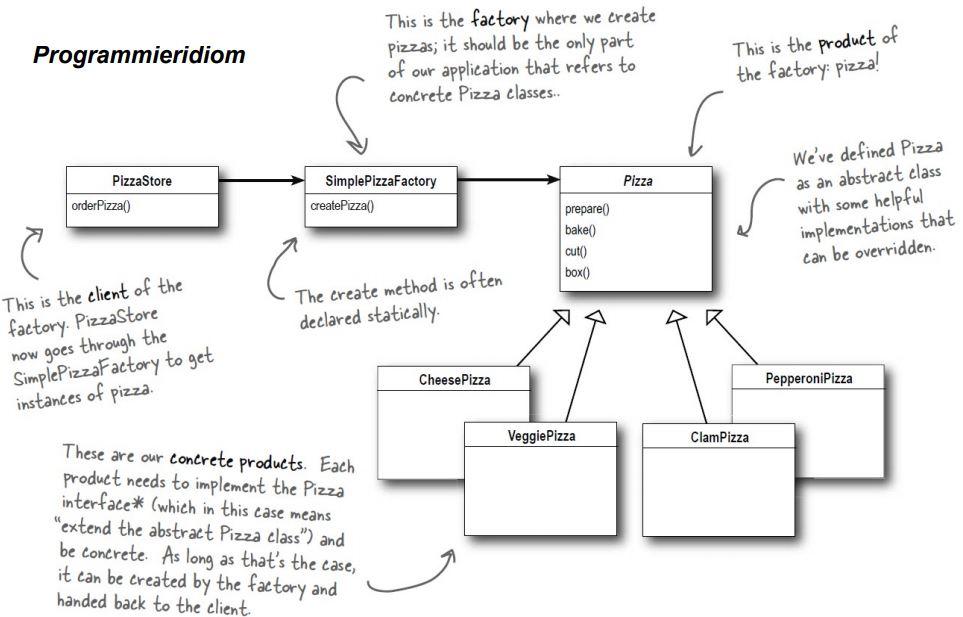
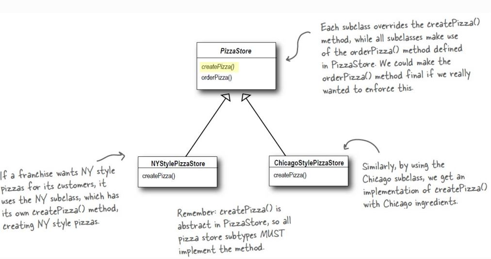
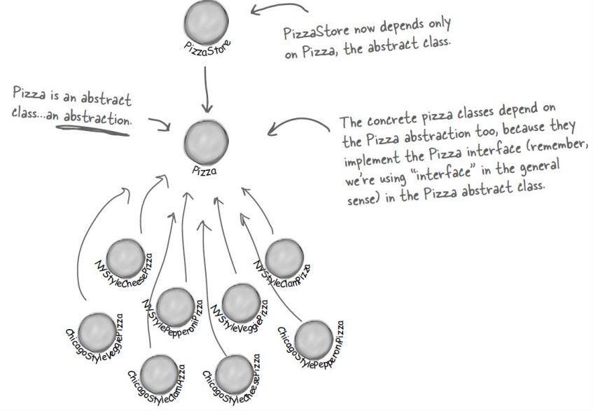
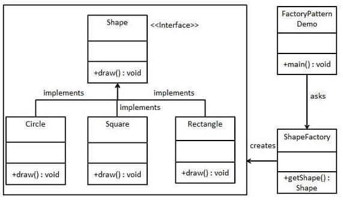

# Simple Factory Pattern
* __creational__ Pattern
* Kapselung
  * Änderungen müssen nur an einer Stelle durchgeführt werden
  * Konkrete Instantierung aus Client-Code entfernt
* Definiert eine Schnittstelle zur Erstellung eines Objekts, lässt aber die Unterklassen entscheiden, welche Klassen instantiiert werden. Factory Method ermöglicht einer Klasse, die Instantiierung in Unterklassen zu verlangen
* Ziel  ist Abhängigkeiten von konkreten Klassen zu reduzieren (Dependency Inversion Principle)
* Hochstufige Komponenten sollen nicht von niedrigstufigen Elementen abhängig sein, stattdessen sollten sich beide auf Abstraktionen stützen

* Alle Factories kapseln die Objekt-Erstellung
* Die einfache Fabrik ist eine unkomplizierte Möglichkeit, Clients von konkreten Klassen zu entkoppeln
* Factory-Method stützt sich auf Vererbung: Die Objekterstellung wird an Unterklassen delegiert, die die Fabrikmethode implementieren, um Objekte zu erstellen
* Der Zweck von Factory-Method ist es, einer Klasse zu ermöglichen, die Instantiierung bis in ihre Unterklassen zu verzögern
* Das Prinzip der Umkehrung der Abhängigkeiten leitet uns an, Abhängigkeiten von konkreten Typen zu vermeiden und Abstraktionen anzustreben

## Richtlinien
* Keine Variable sollte eine Referenz auf eine konrekte Klasse halten
* Keine Klasse sollte von einer konkreten Klasse abgeleitet sein
* Keine Methode sollte eine implementierte Methode einer ihrer Basisklassen überschreiben

## Nachteile
* zu viel Flexibilität
* Framework erwünscht

## Problem
* Code, der viele konkrete Klassen verwendet, verursacht Probleme beim Hinzufügen von neuen, konkreten Klassen!
* zu viele abhängige Objekttypen
* Direkte Änderung im Code (muss geöffnet werden)

## Kontext

Dadurch das wie die Objekt-Erstellung kapeseln. Trennen wir veränderbares von statischem.

Die Pizzakette wird erweitert, createPizza ist abstrakt und muss somit bei den Subtypen implementiert werden.

Die Subtypen entscheiden welche Art von Pizza erstellt wird.

So sieht das __Umkehrung der Abhängigkeiten Prinzip__ aus.

## Lösung

### Design

Man sieht ShapeFactory kann ein Shape erstellen. Dieses kann Circle, Square oder Rectangle sein. Es können leicht  Subtypen hinzugefügt/geändert werden.

### Code-Beispiel
[Hier](https://github.com/amessner-tgm/design_patterns/tree/master/Factory/Simple/Beispiel) sieht man ein Beispiel zum SimpleFactory Pattern

# Quellen
* https://elearning.tgm.ac.at/pluginfile.php/45193/mod_resource/content/0/DesignPatterns_Factory.pdf
* https://www.philipphauer.de/study/se/design-pattern.php
* https://www.tutorialspoint.com/design_pattern/factory_pattern.htm
