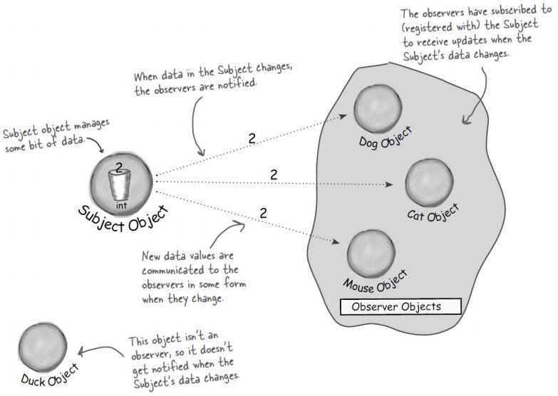
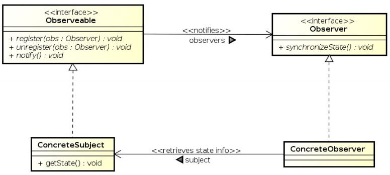
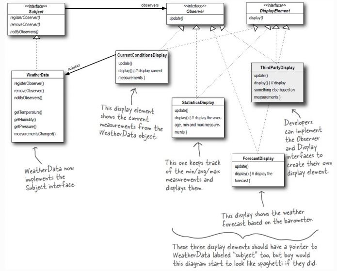

# Observer Pattern
* __behavioral__ Design Pattern
* wird verwendet wenn der Status eines Objektes sich __verändert__ und wichtig ist, Benachrichtigung
* definiert eine __Eins-zu-viele Abhängigkeit__ zwischen Objekten in der Art,
dass alle abhängigen Objekte benachrichtigt werden,wenn sich der Zustand des einen Objektes ändert.
* locker gebunden (Interaktion mit wenug Detailwissen)
* lockere Kopplung zwischen Subjekt und Beobachter
  * Subjekt kennt von einem Beobachter nur die Beobachter-Schnittstelle
  * Subjekt muss für neue Beobachter nicht verändert werden
  * Subjekt und Beobachter unabhängig verwendbar

## Funktionsweise in Java
* Beobachter-Klassen implementieren java.util.Observer
* Subject-Klasse erweitert java.util.Observable
* Nachricht schicken
  * setChanged() aufrufen
  * notifyObservers()
  * notifyObservers(Object arg)
* Benachrichtigung erhalten
  * update(Observable o, Object arg) implementieren

## Nachteile
* Observable ist eine __Klasse__
  * man muss sie erweitern
  * keine eigene Implementierung
* Observable schützt entscheidene Methoden
  * protected setChanged() nur in Unterklasse aufrufbar
  * Komposition ist aber der Vererbung vorzuziehen

## Problem
```Java
currentConditionsDisplay.update(temp,humidity,pressure);
statisticsDisplay.update(temp,humidity,pressure);
forecastDisplay.update(temp,humidit,pressure);
```
Hier wird konkret implementiert, kein anderer Weg für Veränderung/Erweiterung als direkt Code zu ändern.

## Kontext
### Projekt Wetterstation
* basiert auf Wetterdaten-Objekt
* 3 Anzeige Elemente (aktuell, Statistik, Vorhersage)
* Aktualisierung in Echtzeit
* API für zukünftige Erweiterungen

### Zeitungsabo
* Verlag startet sein Geschäft und veröffentlicht Zeitungen
* Man abonniert ein bestimmtes Produkt
  * Jedes Mal, wenn das Produkt aktualisiert wird, bekommt man eine neue Ausgabe
* Das Abo kann jederzeit gekündigt wernden
  * Man erhält auch keine Aktualisierungen mehr



#### Erklärung
* Wie bei Zeitungsabo beschrieben kann die Notification jederzeit beendet werden
* Nur die Observer-Objects bekommen Notifications
* Hier sieht man auch die 1-N Abhängigkeit

## Lösung
### Design

#### Erklärung
##### Observable
Interface das zur Registrierung als Observer oder zum Entfernen als Observer verwendet wird.

##### ConcreteSubject
Implementiert Observable

##### Observer
Alle Observer müssen das Observer-Interface implementieren.
update() wird gecallt wenn der Status von Observable sich ändert.

##### ConcreteObserver
Jede Klasse die Observer-Interface implementiert. Jeder Observer registriert sich mit einem ConcreteSubject um Updates(Notifications) zu erhalten.

#### Projekt Wetterstation
Hier das UML Diagramm zu "Wetterstation". Hier wurd noch ein Interface DisplayElement erschaffen. Es dient dazu immer neue Displays implementieren zu können.



### Code-Beispiel
[Hier](https://github.com/amessner-tgm/design_patterns/tree/master/Observer/Beispiel) sieht man wie des Abo-System funktioniert. Es werden immer alle Subscriber benachrichtigt.

# Quellen
* https://elearning.tgm.ac.at/pluginfile.php/62636/mod_resource/content/0/DesignPatterns_Observer.pdf
* https://www.tutorialspoint.com/design_pattern/observer_pattern.htm
* https://www.journaldev.com/1739/observer-design-pattern-in-java
