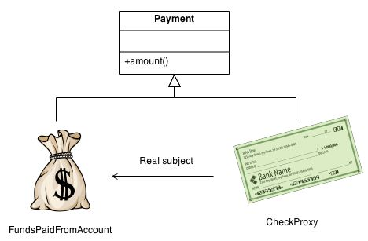
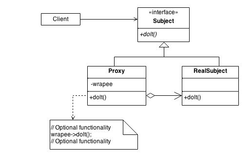

# Proxy pattern
* __structural__ Pattern
* Ein Objekt wird erschafft, dass das originale Objekt als Interface eingebunden hat.

## Problem
Es gibt Objekte die viele Ressourcen fressen, diese sollen aber erst verwendet werden, wenn sie wirklich vom Client requested werden.
## Kontext
### Payment Beispiel
Proxy stellt ein Objekt zur Verfügung. Ein Check oder eine Bankzahlung ist ein Beispiel. Man greift also auf ein echtes Objekt zu (Bankaccount) mit einem Check (Proxy).

## Lösung
### Design

### Code-Beispiel
[Hier](https://github.com/TGM-HIT/sew4-design-patterns-amessner-tgm/tree/master/Proxy/Beispiel) sieht man ein Beispiel zum Proxy Pattern.

## Quellen
* https://sourcemaking.com/design_patterns/proxy
* https://www.tutorialspoint.com/design_pattern/proxy_pattern.htm
