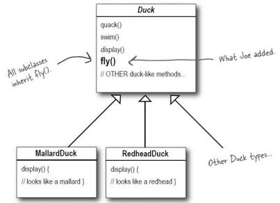
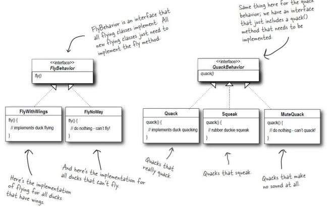
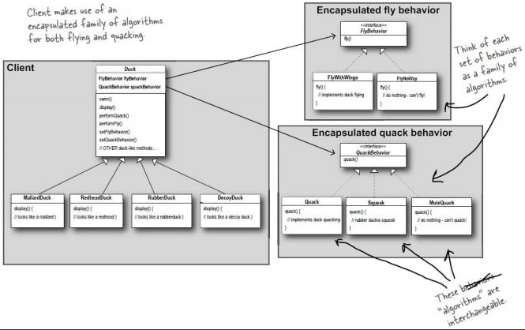
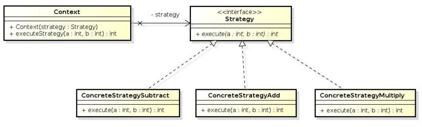

# Strategy Pattern
* __behavioral__ pattern
* defininiert eine Familie von Algorithmen, kapselt sie einzeln und macht sie austaschbar
* Algorithmus unabhängig von Clients variierbar
* behavior oder Algorithmus kann während Laufzeit geändert werden

## Kontext

### Enten Beispiel

#### Problem

Sichtbar ist das jetztige Konzept, jedoch wenn eine Ente: RubberDuck hinzugefügt werden soll kommt es zu einem Problem. Denn die RubberDuck quackt nicht.

#### Lösung
Um dieses Problem zu lösen entwickelt man Behaviors.

Diese geben an wie sich die Duck verhalten soll. Das Kozept ist dann auch erweiterbar ohne Code zu verdoppeln.

##### Gesamtkonzept

### Design

#### Context
Objekt wie z.B.: Ente, kann auch Subtypen haben.

#### Strategy
Händelt die Strategy/Algorithmus

#### ConreteStrategy
Die konkrete Strategy/Algorithmus der ausgeführt wird.

### Code-Beispiel
[Hier](https://github.com/amessner-tgm/design_patterns/tree/master/Strategy/Beispiel) sieht man ein Beispiel zum Strategy Pattern, der Aufbau ist der selbe wie zu dem UML Diagramm zu Design.

# Quellen
* https://elearning.tgm.ac.at/pluginfile.php/45191/mod_resource/content/0/DesignPatterns_Strategy.pdf
* https://www.tutorialspoint.com/design_pattern/strategy_pattern.htm
